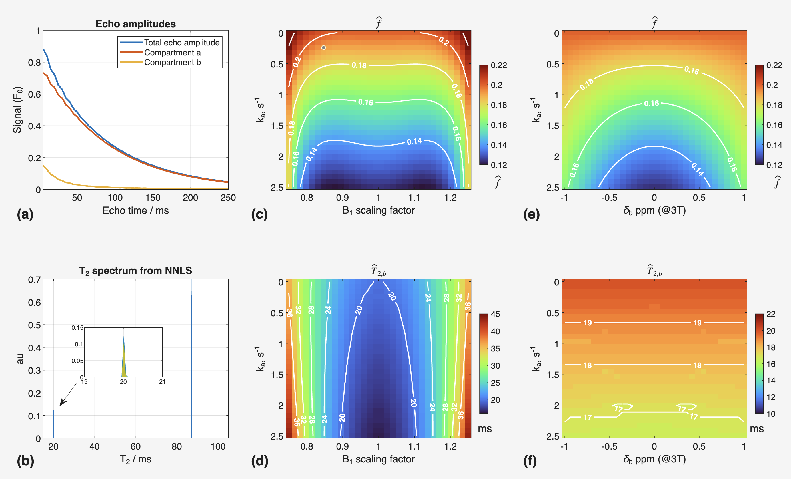
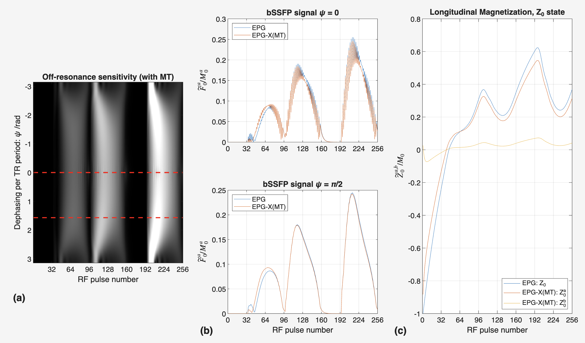
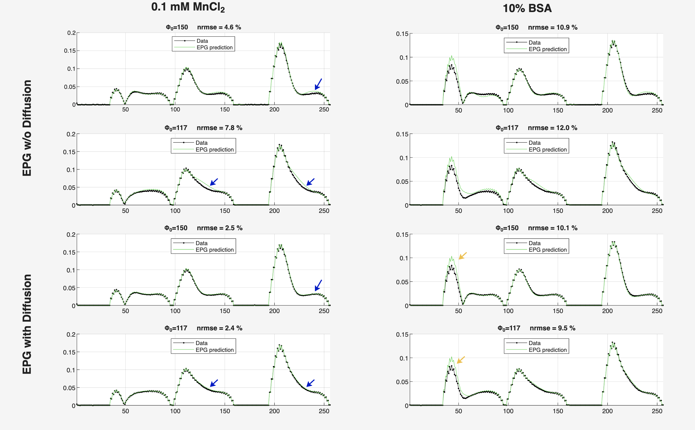
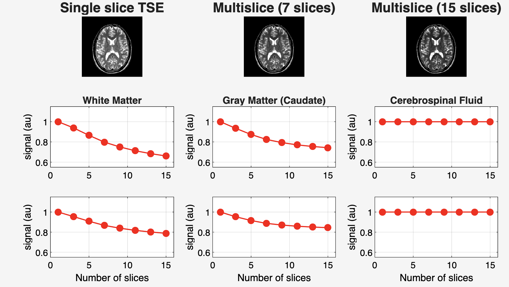

# EPG Tests

This repository contains a small set of MATLAB scripts and generated figures that illustrate several Extended Phase Graph (EPG) simulations and their interpretation. The examples are adapted from the EPG-X framework developed in the repository [EPG-X](https://github.com/mriphysics/EPG-X/tree/master) and are intended as compact, educational test cases for understanding how different pulse sequences and tissue models behave.

## What this repository contains

The repository currently includes MATLAB scripts and corresponding PNG outputs for several EPG-based experiments:

- [Test2.m](Test2.m) and [Test2.png](Test2.png)
- [Test3a.m](Test3a.m) and [Test3a.png](Test3a.png)
- [Test3b.m](Test3b.m) and [Test3b.png](Test3b.png)
- [Test4.m](Test4.m) and [Test4.png](Test4.png)
- [Tsetest.m](Tsetest.m)

## Overview of the tests

### 1. Test 2 — Multi-echo CPMG and two-pool exchange

Files:
- [Test2.m](Test2.m)

Purpose:
- Simulates a multi-echo CPMG experiment for a two-compartment exchange model.
- Investigates how apparent relaxation properties change when the exchange rate, B1 scaling, and off-resonance are varied.

What it means:
- The script estimates apparent $T_2$ and pool fraction from the echo train using non-negative least squares.
- The resulting figures help visualize how the measured signal can look like a mixture of fast- and slow-relaxing components, and how imperfections such as B1 error or off-resonance can bias the interpretation.
- This is useful for understanding how exchange and pulse imperfections affect quantitative relaxation measurements.

### 2. Test 3a — Transient SPGR / white matter MT simulation

Files:
- [Test3a.m](Test3a.m)

Purpose:
- Compares a standard EPG simulation with an EPG-X magnetization transfer (MT) simulation in a transient spoiled gradient echo sequence.
- Uses a white-matter-like model to illustrate how MT changes the signal and longitudinal magnetization.

What it means:
- The figures show how the presence of an MT pool alters signal amplitude and longitudinal recovery.
- This helps demonstrate that a simple single-pool model can be insufficient when exchange with a semi-solid pool is present.
- The output is relevant for understanding MT effects in MRI experiments such as SPGR-based quantitative imaging.

### 3. Test 3b — Balanced SSFP and off-resonance sensitivity

Files:
- [Test3b.m](Test3b.m)

Purpose:
- Extends the previous MT analysis to a balanced SSFP setting.
- Evaluates how MT changes the signal and the longitudinal magnetization over a range of off-resonance states.

What it means:
- The script shows how bSSFP signal behavior depends strongly on off-resonance and how MT modifies the response.
- The plots are useful for understanding why MT can influence contrast, banding behavior, and sensitivity to resonance offsets in SSFP-type sequences.

### 4. Test 4 — Experimental IR-TFE / MRF-style fitting example

Files:
- [Test4.m](Test4.m)

Purpose:
- Uses an experimental inversion-recovery / transient-field-echo-style dataset to compare measured signals with EPG predictions.
- Includes a comparison between simulations with and without diffusion, and explores a two-pool MT model fit.

What it means:
- The script demonstrates how EPG simulations can be compared against real data to test whether a given biophysical model is appropriate.
- It also illustrates how diffusion and MT can affect the fit and the interpretation of measured signals.
- This is particularly relevant for quantitative MRI and magnetic resonance fingerprinting-style experiments.

### 5. Tsetest — TSE / multislice simulation example

Files:
- [Tsetest.m](Tsetest.m)

Purpose:
- Simulates a turbo spin echo (TSE) experiment for multiple slices and compares the expected signal behavior under different slice configurations.

What it means:
- The script is useful for examining how slice ordering, pulse design, and relaxation effects influence signal evolution in a multislice TSE experiment.
- It provides a practical example of how EPG can be used to model realistic sequence behavior beyond simple single-echo experiments.

## Notes

- These scripts are written in MATLAB and assume that the EPG-X function library is available in the repository folder structure.
- The figures in the repository are generated outputs from running the scripts and are included for quick visual inspection.
- The code here is adapted from the broader EPG-X repository and is meant to be a compact demonstration set rather than a full standalone toolbox.

## How to run

1. Open MATLAB.
2. Change the current folder to this repository.
3. Run any of the MATLAB scripts, for example:
   - `Test2`
   - `Test3a`
   - `Test3b`
   - `Test4`
   - `Tsetest`

If the EPG-X functions are present in the expected location, the scripts should run and recreate the included PNG figures.
